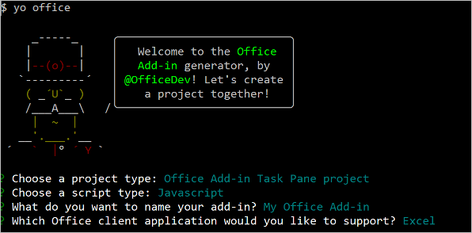

# Build an Excel task pane add-in 
이 문서의 원본은 [여기](https://docs.microsoft.com/en-us/office/dev/add-ins/quickstarts/excel-quickstart-jquery?tabs=yeomangenerator)를 참고한다. 


## Prerequisites

* Node.js (the latest LTS version).
* The latest version of [Yeoman](https://github.com/yeoman/yo) and the [Yeoman generator for Office Add-ins](https://docs.microsoft.com/en-us/office/dev/add-ins/develop/yeoman-generator-overview). To install these tools globally, run the following command via the command prompt.


> LTS release status is "long-term support"

```
npm install -g yo generator-office
```


```
(base) PS C:\Users\latte> npm install -g yo generator-office
npm WARN deprecated har-validator@5.1.5: this library is no longer supported
npm WARN deprecated uuid@3.4.0: Please upgrade  to version 7 or higher.  Older versions may use Math.random() in certain circumstances, which is known to be problematic.  See https://v8.dev/blog/math-random for details.
npm WARN deprecated request@2.88.2: request has been deprecated, see https://github.com/request/request/issues/3142

added 953 packages, and audited 954 packages in 57s

65 packages are looking for funding
  run `npm fund` for details

7 vulnerabilities (5 moderate, 2 high)

To address issues that do not require attention, run:
  npm audit fix

To address all issues (including breaking changes), run:
  npm audit fix --force

Run `npm audit` for details.
npm notice
npm notice New minor version of npm available! 8.0.0 -> 8.9.0
npm notice Changelog: https://github.com/npm/cli/releases/tag/v8.9.0
npm notice Run npm install -g npm@8.9.0 to update!
npm notice
```

npm 버전이 낮아서 업데이트하라고 메지지가 나와서 업데이트했다. 


## Create the add-in project

Yeoman generator를 사용하여 add-in project를 생성한다. 
```
yo office 
```



질문이 나온다. 다음과 같이 답한다. 

* Choose a project type: Office Add-in Task Pane project
* Choose a script type: Javascript
* What do you want to name your add-in? My Office Add-in
* Which Office client application would you like to support? Excel

"My Office Add-in" 폴더가 생성된다. 

1. 폴더로 들어가서 
2. npm start 
3. VS Code에서 프로젝트를 오픈한다.    
```
code .
```


npm start 하면 다음과 같이 오류가 난다. 
```
unable to App type: desktop
? Allow localhost loopback for Microsoft Edge WebView? Yes
Error: Unable to start debugging.
```

Terminal을 관리자 모드로 오픈한 다음에 npm start를 시작하면 정상적으로 필요한 패키지를 설치하고 정상적으로 실행된다. 


